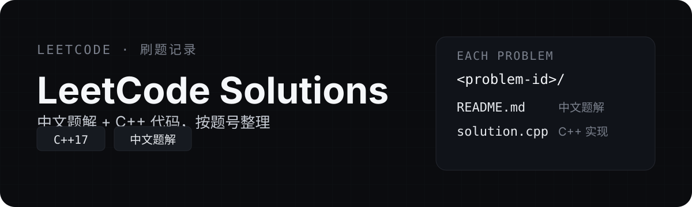

# LeetCode Solutions

> 我的 LeetCode 刷题笔记：**中文题解 + C++ 代码**，按题号整理，持续更新。每道题独立成目录，方便按题号快速检索。

<p align="center">
  
</p>

<!-- leetcode-index:start -->

## Problems

| # | Problem | Difficulty | Topic |
|---|---|---|---|
| [0003](0003-longest-substring-without-repeating-characters) | Longest Substring Without Repeating Characters | Medium | Hash Table |
| [3568](3568-minimum-moves-to-clean-the-classroom) | Minimum Moves to Clean the Classroom | Medium | BFS |
| [3875](3875-construct-uniform-parity-array-i) | Construct Uniform Parity Array I | Easy | Array |
| [3876](3876-construct-uniform-parity-array-ii) | Construct Uniform Parity Array II | Medium | Array |
| [3903](3903-smallest-stable-index-i) | Smallest Stable Index I | Easy | Array |

共 5 道题。

<!-- leetcode-index:end -->
## 这是什么

这是一份面向面试与个人复习的 LeetCode 刷题记录。每道题都写成独立的 Markdown 题解：中文思路、复杂度分析，以及可直接运行的 C++ 代码，而不是只粘贴一个通过答案。

## 如何浏览

题目目录统一按 **LeetCode 题号** 命名，例如 `3875-construct-uniform-parity-array-i/`。从上方的题目索引进入，或直接在仓库里搜索题号。

每个题目目录的结构如下：

```text
3875-construct-uniform-parity-array-i/
├── README.md     # 中文题解：题意、思路、复杂度、C++ 代码
└── solution.cpp  # 可直接编译运行的 C++ 实现
```

## 约定

- 题目索引（上方 `## Problems` 表格）由脚本自动生成，请保留 `<!-- leetcode-index:start -->` 与 `<!-- leetcode-index:end -->` 之间的内容，否则索引会被覆盖。
- 所有题解默认使用 **C++17**。
- 仅供个人学习与复习使用。
